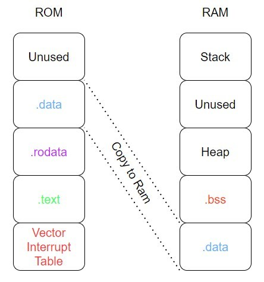

# Custom Runtime (CRT) Project for ATmega328P

This project outlines how to create a custom runtime for the ATmega328P, incorporating a custom mathematical utility library for operations not natively supported by the hardware.

## Requirements

- **Hardware**: ATmega328P-based board 
- **Software**:
  - `avr-gcc`: AVR toolchain for compiling your code.
  - `avr-objcopy`: Tool for converting the compiled output into various formats.
  - `avrdude`: Software for uploading the firmware to the microcontroller.
  - `GNU Make`: Build automation tool to run the Makefile.
  - `screen`: Utility for serial communication with your board.
- **Operating System**: macOS and Linux.

## Setup

1. **Install Required Software**:
   - On **Debian/Ubuntu**: `sudo apt-get install gcc-avr avr-libc avrdude make screen`
   - On **macOS** (using Homebrew): `brew install avr-gcc avrdude avrdude --with-usb`

``


- `crt1.S`: Custom runtime startup code.
- `math_util.c`: Mathematical utility functions source file.
- `math_util.h`: Header file for the mathematical utility functions.

## Building the Project

```
make all
```

## Uploading the Firmware

```
make upload
```

## Serial Monitor

```
make monitor
```

## Cleaning Up

```
make clean
```

